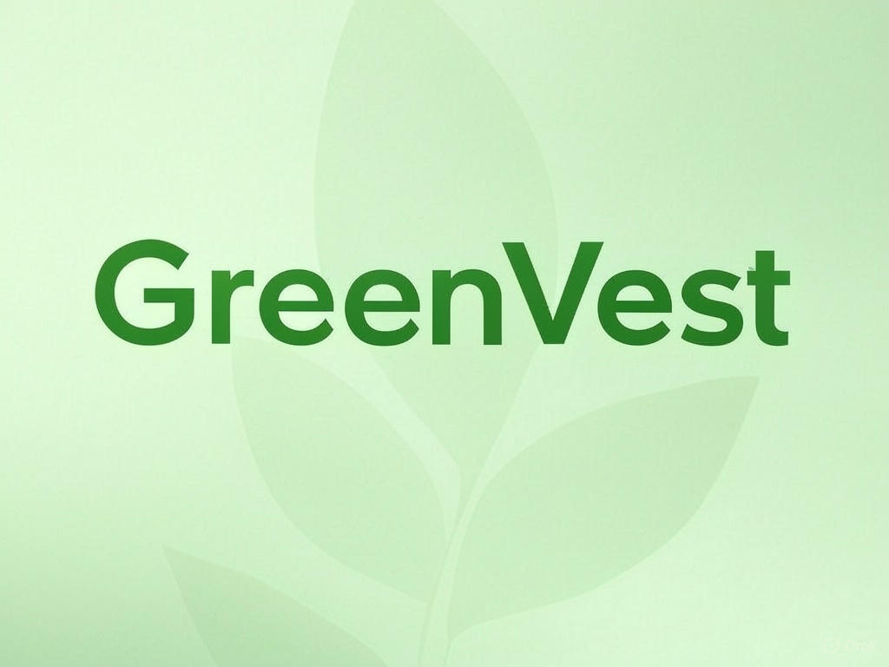

# GreenVest - Powering Tomorrow's Sustainability 🌱

  

## 📱 About GreenVest

GreenVest is a mobile investment platform that connects new gen investors with sustainable energy projects, focusing on rural development initiatives in India. Our mission is to accelerate the transition to renewable energy by making green investments accessible to everyone.

### 🌟 Key Features

- **Browse Sustainable Projects**: Explore curated renewable energy projects from wind farms to hydropower initiatives
- **GenAI driven Analysis**: Gamifies Green stock trends and comparions to suit younger audiences and provides actionable insights
- **Track Impact**: Monitor your contribution to sustainable development and environmental impact
- **Rural Focus**: Support projects that bring renewable energy to underserved rural communities
- **Real-time Updates**: Stay informed about project progress and milestones

## 🚀 Getting Started

### Prerequisites

- Node.js (v14 or later)
- npm or yarn
- Android Studio (for Android development)
- Expo CLI

## 🛠️ Built With

- **[React Native](https://reactnative.dev/)** - Core framework
- **[Expo](https://expo.dev/)** - Development platform
- **[TypeScript](https://www.typescriptlang.org/)** - Programming language
- **[React Native Reanimated](https://docs.swmansion.com/react-native-reanimated/)** - Animations

## 📱 Screenshots

  
  
  

## 🌿 Features in Detail

### Project Discovery
- Browse through various renewable energy projects
- Filter by location, project type, and investment range
- Detailed project information and impact metrics

### Project Tracking
- Live progress updates
- Impact measurement
- Investment portfolio management

## 📞 Contact

Your Name - [@prithveei](https://x.com/prithveei) - prithvimarwadiwork@gmail.com

---

  Made with 💚 for a sustainable future

